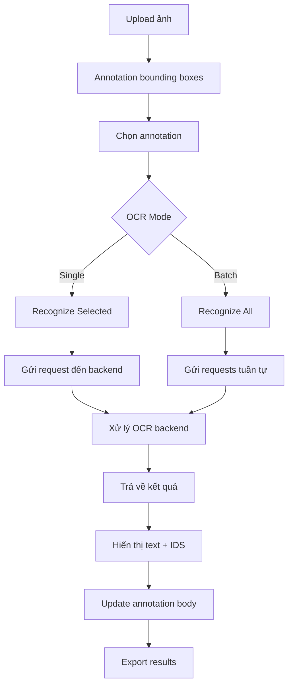

# Tính năng Nhận diện Mặt chữ Hán-Nôm (OCR)

## Tổng quan

Tính năng OCR (Optical Character Recognition) được tích hợp vào web-app Hán-Nôm Annotator cho phép nhận diện tự động các ký tự Hán-Nôm sau khi annotation văn bản thành công.

## Cấu trúc File

### Frontend (React)

```
src/
├── utils/
│   └── ocr.js                    # API utility cho OCR requests
├── components/
│   ├── OcrRecognizer.jsx         # Component OCR UI
│   ├── AnnotationEditor.jsx      # Đã tích hợp OCR
│   └── FileManager.jsx           # Thêm OCR endpoint config
└── Backend Sample/
    ├── ocr_inference.py          # Code mẫu OCR inference
    ├── main.py                   # YOLO detection server
    └── ocr_api_server.py         # Backend API server đề xuất
```

## Chức năng

### 1. OCR Component (`src/components/OcrRecognizer.jsx`)

Component chính cho tính năng OCR với các chức năng:

- **Nhận diện đơn**: Nhận diện mặt chữ của annotation đang chọn
- **Nhận diện hàng loạt**: Nhận diện tất cả annotations trong ảnh
- **Hiển thị kết quả**: Hiển thị ký tự, IDS code, và độ tin cậy
- **Thanh tiến trình**: Theo dõi quá trình xử lý batch
- **Thống kê**: Tổng số, đã nhận diện, còn lại

### 2. OCR Utility (`src/utils/ocr.js`)

Module xử lý giao tiếp với backend API:

```javascript
// Nhận diện đơn
recognizeCharacter(endpoint, imageFile, bbox, naturalW, naturalH);

// Nhận diện batch
recognizeCharactersBatch(endpoint, imageFile, bboxes, naturalW, naturalH);

// Test endpoint
testOcrEndpoint(endpoint);
```

### 3. Integration trong AnnotationEditor

OCR được tích hợp vào sidebar của AnnotationEditor:

- Tự động load OCR endpoint từ localStorage
- Callback để update annotations với kết quả OCR
- Lưu trữ kết quả OCR trong state

## Sử dụng

### Bước 1: Cấu hình OCR Endpoint

1. Vào trang **File Manager** (chọn Manual hoặc API mode)
2. Tìm section **"OCR Configuration"**
3. Nhập URL endpoint OCR backend:
   ```
   http://localhost:8001/api/ocr
   ```
4. Endpoint được lưu tự động vào localStorage

### Bước 2: Annotation

1. Upload ảnh và annotation như bình thường
2. Tạo bounding boxes cho các ký tự

### Bước 3: Nhận diện OCR

Trong **Annotation Editor**, sidebar bên trái có panel **"OCR Recognition"**:

#### Nhận diện một ký tự:

1. Click chọn annotation muốn nhận diện
2. Click button **"Recognize Selected"**
3. Kết quả hiển thị ngay lập tức

#### Nhận diện tất cả:

1. Click button **"Recognize All"**
2. Theo dõi thanh tiến trình
3. Xem kết quả trong danh sách bên dưới

### Kết quả OCR

Mỗi kết quả bao gồm:

- **Character**: Ký tự được nhận diện (字)
- **IDS**: Mã IDS Unicode (U+5B57)
- **Confidence**: Độ tin cậy (0-100%)

## Backend API

### Yêu cầu

File `ocr_api_server.py` cung cấp template cho backend API:

**Request Format:**

```
POST /api/ocr
Content-Type: multipart/form-data

Fields:
- image: File (ảnh gốc)
- x: float (tọa độ x tâm, pixels)
- y: float (tọa độ y tâm, pixels)
- width: float (chiều rộng, pixels)
- height: float (chiều cao, pixels)
```

**Response Format:**

```json
{
  "text": "字",
  "ids": "U+5B57",
  "confidence": 0.95
}
```

### Cài đặt Backend

1. **Cập nhật Config** trong `ocr_api_server.py`:

   ```python
   class Config:
       VOCAB_IDS = "path/to/vocab_ids.txt"
       IDS_EXP = "path/to/ids_exp.txt"
       OCR_CHECKPOINT = "path/to/checkpoint.ckpt"
   ```

2. **Cài đặt dependencies**:

   ```bash
   pip install litserve pillow torch torchvision
   ```

3. **Chạy server**:
   ```bash
   python ocr_api_server.py
   ```
   Server sẽ chạy trên `http://localhost:8001`

### Testing API

**Sử dụng curl:**

```bash
curl -X POST http://localhost:8001/api/ocr \
  -F "image=@image.jpg" \
  -F "x=100" \
  -F "y=200" \
  -F "width=50" \
  -F "height=50"
```

**Sử dụng Python:**

```python
import requests

files = {'image': open('image.jpg', 'rb')}
data = {'x': 100, 'y': 200, 'width': 50, 'height': 50}

response = requests.post('http://localhost:8001/api/ocr',
                        files=files, data=data)
print(response.json())
```

## Workflow Hoàn chỉnh



## Lưu ý Kỹ thuật

1. **Tọa độ**: Frontend gửi tọa độ absolute pixels, backend tự crop
2. **Transform**: Backend tự động resize và transform ảnh theo yêu cầu model
3. **Center-based**: Bounding box sử dụng tọa độ tâm (x, y)
4. **Batch processing**: Xử lý tuần tự để tránh quá tải server
5. **Error handling**: Xử lý graceful cho từng annotation riêng lẻ

## Mở rộng

### Tùy chỉnh UI

- Sửa `src/components/OcrRecognizer.jsx` để thay đổi giao diện
- Thêm filters, sorting, export options

### Tích hợp Model khác

- Cập nhật `ocr_api_server.py` với model mới
- Giữ nguyên API interface

### Performance

- Thêm caching cho kết quả đã nhận diện
- Batch processing song song (parallel)
- WebSocket cho real-time updates

## Troubleshooting

### OCR không hoạt động

1. Kiểm tra endpoint URL đã đúng chưa
2. Verify backend server đang chạy
3. Kiểm tra CORS settings
4. Xem console logs cho errors

### Kết quả không chính xác

1. Kiểm tra quality của bounding box
2. Xem lại model checkpoint
3. Điều chỉnh expand_ratio trong backend

### Performance chậm

1. Giảm số lượng annotations trong batch
2. Tối ưu model inference
3. Sử dụng GPU nếu có

## Liên hệ & Support

Nếu có vấn đề hoặc cần hỗ trợ, vui lòng:

1. Kiểm tra logs trong browser console
2. Kiểm tra logs của backend server
3. Xem lại configuration settings
